## CIS Compliance Assessment with an Identity & Access Focus

  

## Overview

**Scenario:** Northwind Traders' external auditors arrive in two weeks. Last year, **FIN-APP-02**, the payroll application server, failed its configuration review, and nobody had touched it since. I assessed it against the **CIS Ubuntu 24.04 Level 1 Server Benchmark** using **OpenSCAP**, scoped the assessment, drove remediation under change control, documented a risk exception, and produced an audit evidence package.

**Why an IAM lens:** although this is a compliance assessment, most of the in-scope findings were identity and access controls: who can log in remotely, how users authenticate, how credentials are protected, and who can become root. This write-up highlights those findings and maps them to the NIST SP 800-53 **Access Control (AC)** and **Identification and Authentication (IA)** control families.

## Results at a Glance

| Stage | Compliance score |
|---|---|
| Baseline (full CIS profile) | 59.82% |
| Scoped (platform-inherited controls excluded) | 76.86% |
| After manual remediation | 81.01% |
| After reviewed automated remediation | 99.99% |
| **Final** | **99.99%** (261 passed, 0 failed, 1 not assessed) |

## Skills Demonstrated

- Host-level identity and access management (Linux)
- Privileged access management (root login, sudo, su)
- Authentication policy (PAM password quality, lockout, password aging)
- Credential protection and secrets handling
- SCAP, CIS Benchmarks, and OpenSCAP scanning
- Assessment scoping and inherited controls
- Risk-based triage and remediation
- Change control and risk exceptions
- Mapping technical evidence to NIST SP 800-53
- Audit evidence packaging and POA&M

## Environment

| Component | Value |
|---|---|
| Asset | FIN-APP-02 (payroll application server, data classification: Confidential) |
| OS | Ubuntu 24.04 LTS |
| Standard | CIS Ubuntu Linux 24.04 LTS Benchmark v1.0.0, Level 1 - Server |
| Scanner | OpenSCAP 1.3 with ComplianceAsCode content |
| Owner | Finance Applications team |

---

## IAM Findings Mapped to NIST SP 800-53

| Finding | Fix | NIST 800-53 control |
|---|---|---|
| SSH root login enabled by a forgotten 2019 vendor override | Removed the override, set `PermitRootLogin no` | AC-6 Least Privilege, AC-17 Remote Access |
| SSH allowed empty passwords | `PermitEmptyPasswords no` | IA-2 Identification and Authentication, IA-5 Authenticator Management |
| Anyone could SSH in; no access restriction | `AllowGroups sshusers`, with only `payadmin` added | AC-3 Access Enforcement, AC-17 Remote Access |
| `/etc/shadow` readable by every user | `chown root:shadow`, `chmod 640` | IA-5 Authenticator Management, AC-3 Access Enforcement |
| `legacy_batch` account had no password | Account locked with `passwd -l` | AC-2 Account Management, IA-5 |
| No password quality rules | Installed and enforced `pam_pwquality` | IA-5(1) Password-Based Authentication |
| No account lockout | `pam_faillock`, lock after 4 failures | AC-7 Unsuccessful Logon Attempts |
| No password history or expiry | `pam_pwhistory`, 365-day maximum age, inactive-account expiry | IA-5(1), AC-2(3) Disable Accounts |
| No idle session timeout | `TMOUT=900`, SSH `ClientAliveInterval 300` | AC-12 Session Termination |
| sudo did not require re-authentication | `sudo_require_reauthentication` | IA-11 Re-authentication |
| Passwordless sudo for the whole payroll group *(found manually)* | Removed `NOPASSWD` | AC-6 Least Privilege, IA-11 |
| No sudo log | Dedicated sudo logfile | AC-6(9) Log Use of Privileged Functions, AU-12 |
| Database password stored in plaintext *(found manually)* | Restricted file to `root:payroll 640`; rotation logged as open item | IA-5(7) No Embedded Unencrypted Static Authenticators |
| Payroll export and config world-writable *(found manually)* | `chown root:payroll`, `chmod 750/640` | AC-3 Access Enforcement, AC-6 |
| Login banner advertised OS version | Replaced with an authorized-use warning | AC-8 System Use Notification |

---

## Task 1 – Understand What Is Being Measured

Compliance scanning uses **SCAP** (Security Content Automation Protocol), a NIST standard. A SCAP data stream bundles:

- **Benchmarks (XCCDF):** the human-readable rules and their rationale
- **Checks (OVAL):** machine-readable tests for each rule
- **Profiles:** named selections of rules, such as CIS Level 1 Server or DISA STIG

Listing the profiles in the Ubuntu 24.04 content shows CIS Level 1 and Level 2 (Server and Workstation) plus the DISA STIG:

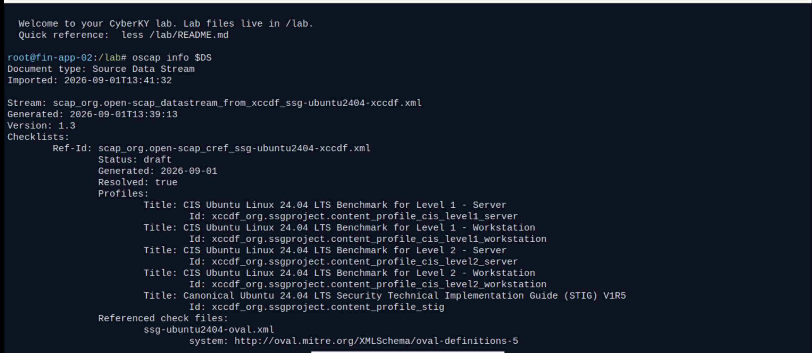

The CIS Level 1 Server profile used for this assessment:

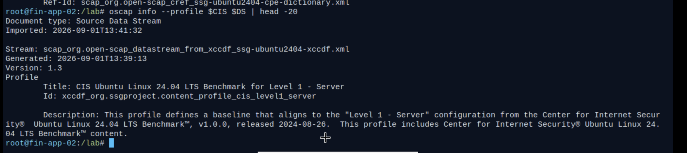

**Checkpoint:**
- **Level 1 vs Level 2:** Level 1 is a practical security baseline that can be applied with little impact on functionality. Level 2 adds defense-in-depth controls for high-security environments, which can reduce usability or break some functionality.
- **Server vs Workstation:** the Server profile assumes no desktop environment and focuses on services and remote access. The Workstation profile includes settings for graphical desktops and end-user systems.

---

## Task 2 – Baseline Assessment

Scanned FIN-APP-02 against the full CIS Level 1 Server profile and saved the results as evidence. The baseline score was **59.82%**, with several high-severity failures. The two at the top are both identity issues: accounts with blank passwords, and login allowed to accounts with empty passwords.

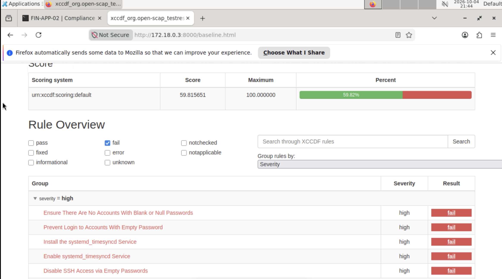

The terminal output shows a cluster of SSH failures, including the access-control rule `sshd_limit_user_access`:

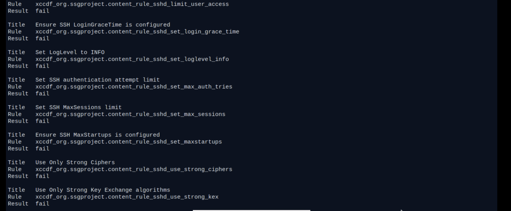

Each failed rule includes a rationale, framework references, and a remediation snippet. For example, the empty-password rule explains that anyone could log in with that account's privileges, and its fix is to lock the account:

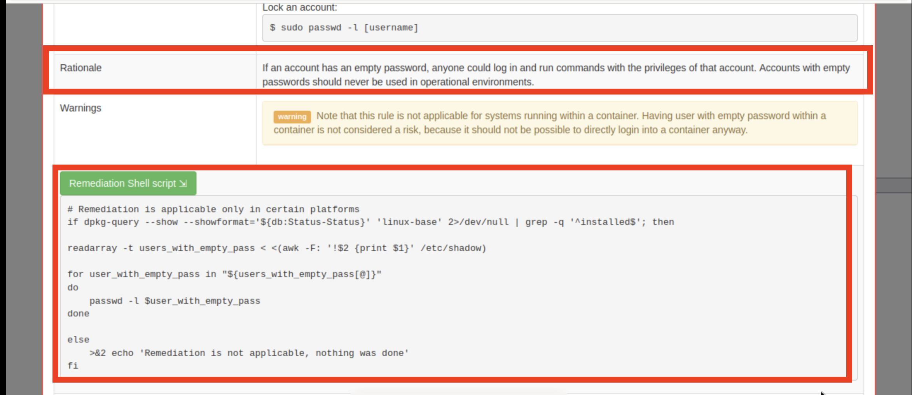

**Why the references matter:** one technical rule, such as permissions on `/etc/shadow`, is evidence for several framework controls at once (CIS, NIST AC-3, PCI DSS). This mapping is how GRC teams answer multiple audits with one set of evidence.

---

## Task 3 – Scope the Assessment

About 40 failures covered kernel parameters, partitions, the boot loader, and services owned by the Virtualization Platform team, which evidences them under its own host baseline (ticket PLAT-2291). Northwind's scope statement keeps **accounts and authentication (PAM, password aging, sudo) and SSH configuration** in scope for the application team.

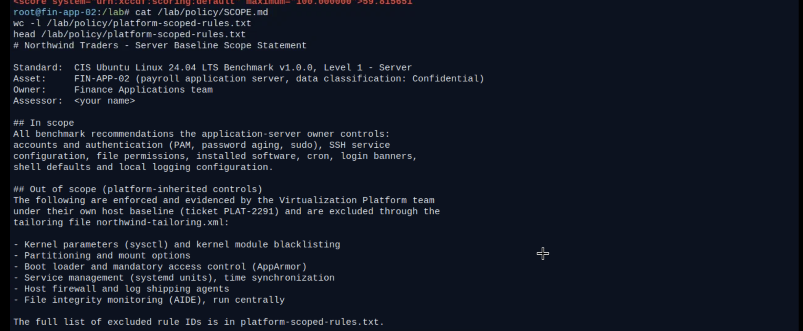

These rules were excluded through a **tailoring file**, the standard SCAP way to adapt a benchmark without editing it. The in-scope assessment scored **76.86%**, and every remaining failure is something this team can and must fix:

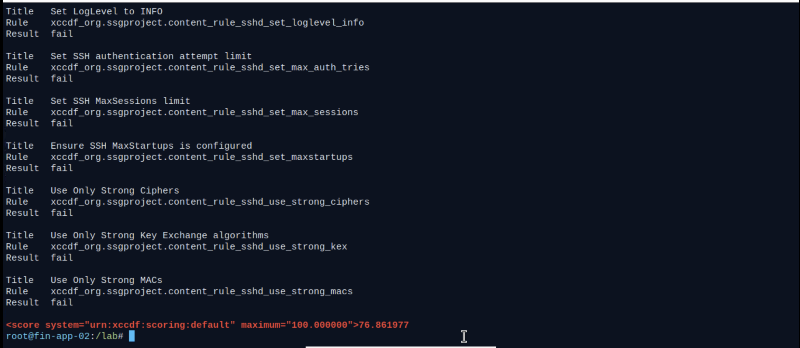

**Auditor's view:** excluding controls is legitimate only when it is documented, justified, and covered elsewhere (an *inherited control* in NIST terms). Excluding a control just to raise the score is a finding in itself.

---

## Task 4 – Triage the Findings

Listed every in-scope failure in readable form:

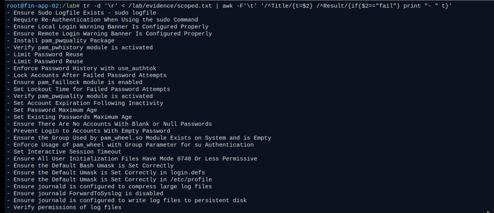

Nearly every item on this list is an identity or access control: sudo logging and re-authentication, password quality, password history, account lockout, password aging, empty passwords, `pam_wheel` restrictions on `su`, and session timeout.

| Theme | Examples | Risk if left unfixed |
|---|---|---|
| Remote access | SSH root login, empty passwords, no access restriction | Direct compromise of the server |
| Credential protection | `/etc/shadow` readable by everyone, an account with no password | Offline password cracking, trivial login |
| Authentication policy | No password quality, lockout, history, or expiry | Guessable passwords, brute force |
| Privileged access | No sudo re-authentication or logging, unrestricted `su` | Unaccountable root access |
| Legacy software | telnet, ftp, and rsync clients | Cleartext protocols |
| Hygiene | Umask, banners, cron permissions, journald | Weaker defense in depth |

**Top three priorities for the engineering team:**
1. **Remote root and empty-password login over SSH:** a direct path to full compromise from the network.
2. **Exposed credentials:** a world-readable password hash file and an account with no password.
3. **No lockout or password quality:** nothing stops brute-force or guessed-password attacks.

---

## Task 5 – Remediate SSH by Hand

### Root cause: forgotten temporary access

The cause was a "temporary" vendor override from 2019, still enabling root login, password authentication, empty passwords, and 10 authentication attempts:

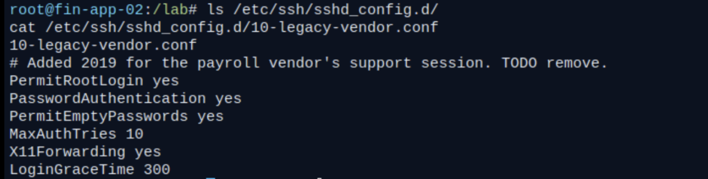

**IAM lesson:** temporary access that is never removed is one of the most common identity findings in audits. Access granted for a vendor support session should have had an owner and an expiration date.

### Fix

Removed the override, created an SSH access group, and added only the payroll administrator:

```bash
rm /etc/ssh/sshd_config.d/10-legacy-vendor.conf
groupadd sshusers
usermod -aG sshusers payadmin
```

Created `/etc/ssh/sshd_config.d/00-cis-hardening.conf` under change ticket **CHG-4471**. Key identity settings:

```
PermitRootLogin no
PermitEmptyPasswords no
MaxAuthTries 4
LoginGraceTime 60
ClientAliveInterval 300
ClientAliveCountMax 3
AllowGroups sshusers
Banner /etc/issue.net
```

The `00-` prefix matters because sshd uses the first value it reads, so the baseline must load before anything else. CIS requires explicitly limiting who may use SSH, and that is a business decision no tool can make automatically.

Validated the config before restarting (a typo can lock every administrator out), confirmed the effective settings, and re-checked the SSH rules. All four now pass:

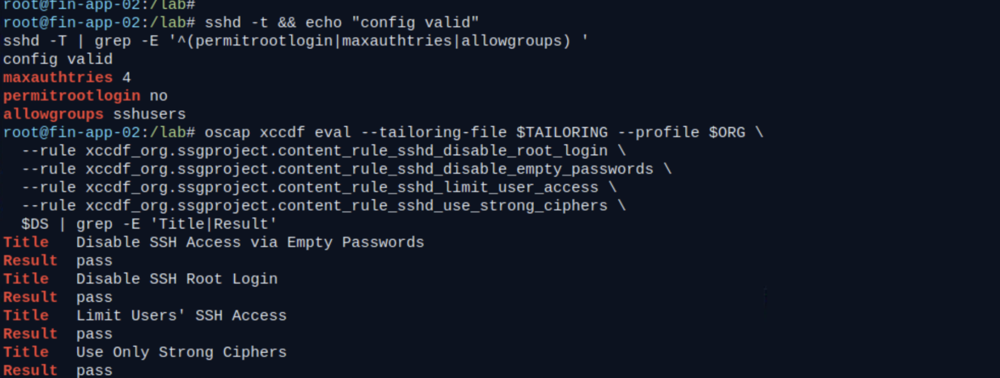

---

## Task 6 – Fix Credentials, Software, and Banners

### Credential protection and account cleanup

`/etc/shadow` was `-rw-r--r--`, meaning every local user could read the password hashes and crack them offline. Restricted it to `root:shadow` with mode `640`. Then found the account with no password, `legacy_batch`, and locked it. Also removed the legacy cleartext clients (telnet, ftp, rsync):

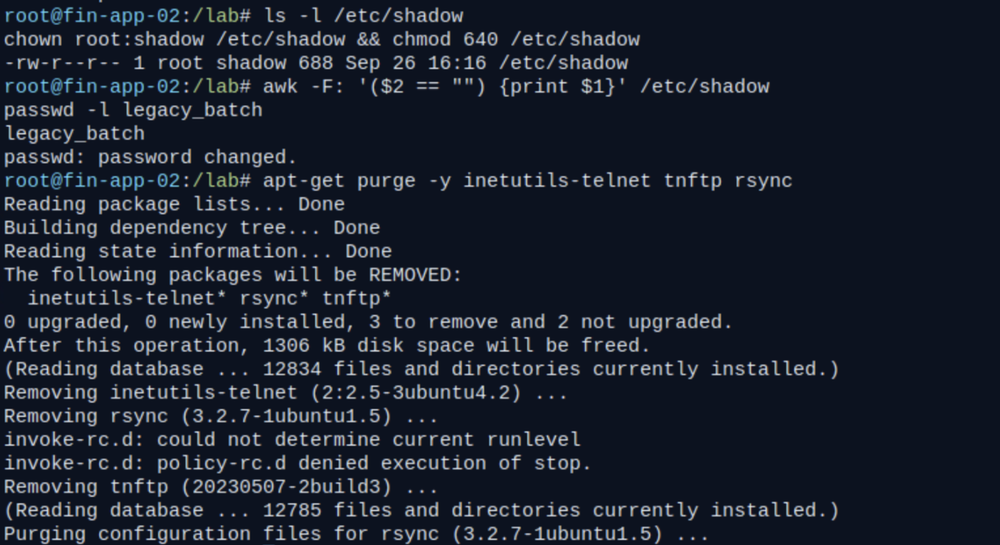

### Banner and password quality

Replaced the login banner that advertised the OS version with an authorized-use warning, then installed the `pam_pwquality` password-quality module from Northwind's internal package mirror (the server has no internet access):

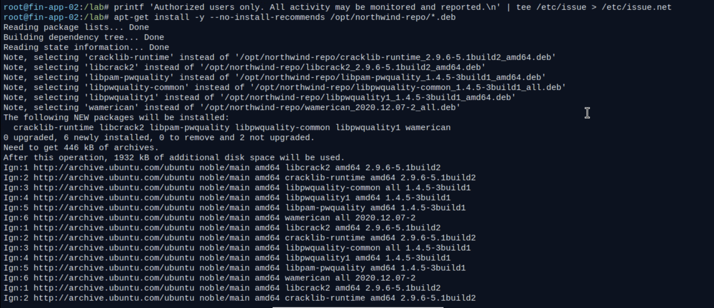

### Cron access control

Restricted cron and at to an allow-list model with `cron.allow` and `at.allow`, so only explicitly authorized users can schedule jobs. The rescan after manual fixes scored **81.01%**:

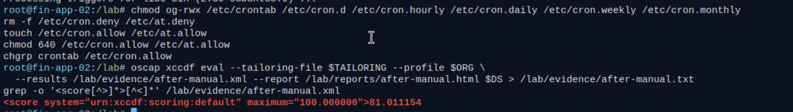

---

## Task 7 – Automated Remediation Needs Change Control

OpenSCAP generated a remediation script with **38 fixes** for the remaining failures. Reviewing the list shows most of them are identity controls: sudo logging and re-authentication, password history, faillock, password quality, and password aging:

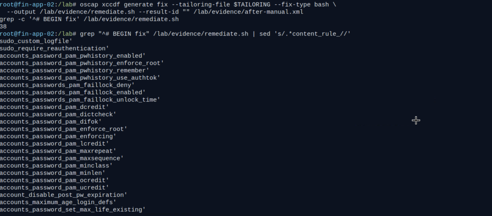

### Reviewing the policy values

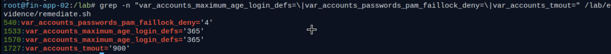

| Setting | Value | Discussion point for the payroll team |
|---|---|---|
| Account lockout (`faillock deny`) | 4 failed attempts | Strong brute-force defense, but confirm the unlock time and the helpdesk process so lockouts don't block payroll runs |
| Password maximum age | 365 days | A reasonable compromise; NIST SP 800-63B now discourages frequent forced rotation |
| Idle shell timeout (`TMOUT`) | 900 seconds | Appropriate for administrative shells on a Confidential-data server |

### Catching the outage before it happened

The script also included `package_nginx_removed`, which would **uninstall nginx, the payroll web front end**. Running it blindly would have taken payroll offline on the day the auditors arrived, so I did not run it.

**Lesson:** benchmarks describe a generic server, not the business. Change management (ITIL, SOC 2 CC8.1, NIST CM-3) requires review and approval before automated changes reach production.

---

## Task 8 – Document a Risk Exception, Then Remediate Safely

The GRC answer is not to quietly skip the rule, but to grant a **documented, approved, time-bound exception**. I added the nginx rule to the tailoring file alongside the platform exclusions, rescanned, regenerated the script, and ran the reviewed version with its log kept as change evidence. The rescan scored **99.99%**:

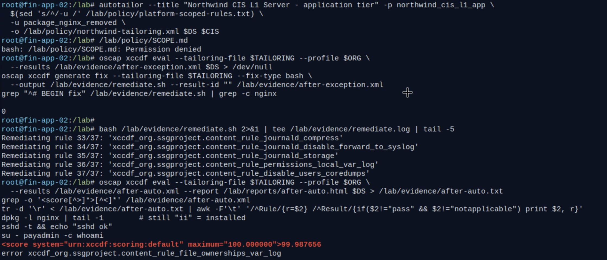

Verification that the nginx removal was gone from the regenerated script (count = 0):


### Risk exception record

| ID | Rule | Justification | Compensating control | Approved by | Expires |
|---|---|---|---|---|---|
| EX-01 | `package_nginx_removed` | nginx serves the payroll application (business-critical) | Web tier behind WAF, nginx patched monthly, only ports 80/443 exposed | Finance Apps Director | 2026-12-31 |

### The one "not assessed" result

`file_ownerships_var_log` returned **error**, meaning the check itself could not complete. It is recorded as **not assessed** with a follow-up, never counted as a pass.

---

## Task 9 – What the Scanner Missed

Automated scans are necessary but not sufficient. Two significant issues passed the scan, and both are access-control failures:

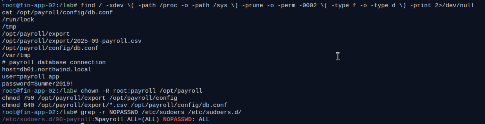

### Finding 1: world-writable payroll data and a plaintext credential

- `/opt/payroll/export` and `2025-09-payroll.csv` were writable by any local user, so anyone could tamper with payroll.
- `/opt/payroll/config/db.conf` was world-writable **and** contained the payroll database password in plain text.

**Fix:**
```bash
chown -R root:payroll /opt/payroll
chmod 750 /opt/payroll/export /opt/payroll/config
chmod 640 /opt/payroll/export/*.csv /opt/payroll/config/db.conf
```

The permissions are fixed, but the credential itself is still a static secret in a file (NIST IA-5(7)). It has been exposed, so it must be **rotated and moved to a secrets manager**. That is logged as an open item.

### Finding 2: passwordless sudo for an entire group

```
/etc/sudoers.d/90-payroll:%payroll ALL=(ALL) NOPASSWD: ALL
```

Every member of `payroll` could become root without re-authenticating, so one compromised payroll account meant full control of the server.

**Fix:** edited the file safely with `visudo -f /etc/sudoers.d/90-payroll` so it reads `%payroll ALL=(ALL) ALL`, then checked the syntax with `visudo -c`.

**Why this matters:** audit programs combine automated testing with inspection and interviews. These findings are reported even though they are now fixed, because auditors care that issues were found and tracked.

---

## Task 10 – Final Assessment and Evidence Package

The final scan scored **99.99%**:

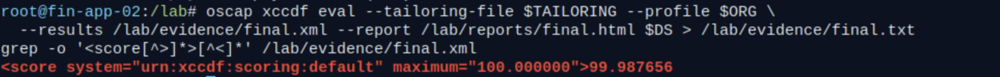

The final report shows **261 rules passed, 0 failed**, and 1 inconclusive (the documented "not assessed" rule):

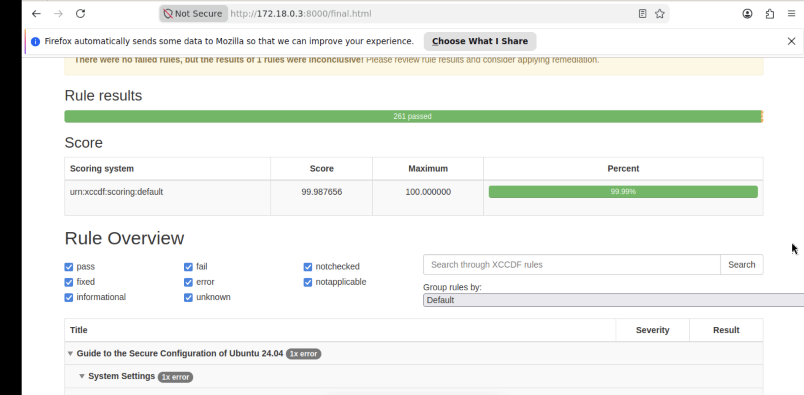

### Assessment summary

**Scope:** FIN-APP-02, CIS Ubuntu 24.04 LTS Benchmark v1.0.0 Level 1 - Server, tailored to exclude platform-inherited controls (PLAT-2291) and one approved business exception (EX-01).

**Remediated findings (CHG-4471):** remote access, credential protection, authentication policy, privileged access, legacy software, and hygiene, as detailed above.

**Exceptions:** EX-01, nginx retained, expires 2026-12-31.

**Manual findings:** world-writable payroll data with a plaintext credential, and passwordless sudo for the payroll group. Both permissions issues were fixed.

### Plan of Action and Milestones (POA&M)

| # | Open item | Owner | Why |
|---|---|---|---|
| 1 | Rotate the payroll database credential and move it to a secrets manager | Finance Applications | Credential was stored in plaintext and exposed |
| 2 | Reassess `file_ownerships_var_log` | Finance Applications | Check errored; recorded as not assessed |
| 3 | Schedule a monthly OpenSCAP scan | Finance Applications | Catch configuration drift |
| 4 | Review EX-01 before 2026-12-31 | Finance Apps Director | Exceptions must be time-bound |
| 5 | Periodically review `sshusers` and `payroll` group membership | Finance Applications | Keep privileged and remote access limited to current staff |

---

## Check Your Work

- [x] Explained data streams, profiles, and CIS levels
- [x] Baseline scan (59.82%) and scoped scan (76.86%) with saved results
- [x] SSH hardened by hand, validated with `sshd -t`, all SSH rules passing
- [x] Credential, software, banner, and cron findings fixed
- [x] Caught the nginx removal during script review before running anything
- [x] nginx exception documented, script regenerated without it, and remediation log captured
- [x] Two scanner blind spots found and fixed by manual inspection
- [x] Final scan at 99.99% with an evidence package and summary

## Key Takeaways

1. **Most hardening is identity hardening.** The majority of in-scope CIS failures were authentication, credential, and privileged-access controls.
2. **Temporary access must expire.** A 2019 vendor override was still granting root SSH access years later.
3. **Least privilege applies to groups too.** Passwordless sudo for an entire group turned every payroll account into a root account.
4. **Secrets don't belong in config files.** Fixing permissions is a stopgap; the credential still needs rotation and a vault.
5. **Scanners miss access-control problems.** Manual inspection found the two most serious issues on the server.
6. **Review automation before running it.** Change control prevented a payroll outage.
7. **Exceptions are documented, approved, and time-bound**, never silent.

## References

- [CIS Ubuntu Linux Benchmarks](https://www.cisecurity.org/benchmark/ubuntu_linux)
- [OpenSCAP](https://www.open-scap.org/)
- [ComplianceAsCode](https://github.com/ComplianceAsCode/content)
- [NIST SP 800-53 Rev. 5](https://csrc.nist.gov/pubs/sp/800/53/r5/upd1/final)
- [NIST SP 800-63B: Digital Identity Guidelines](https://pages.nist.gov/800-63-3/sp800-63b.html)
